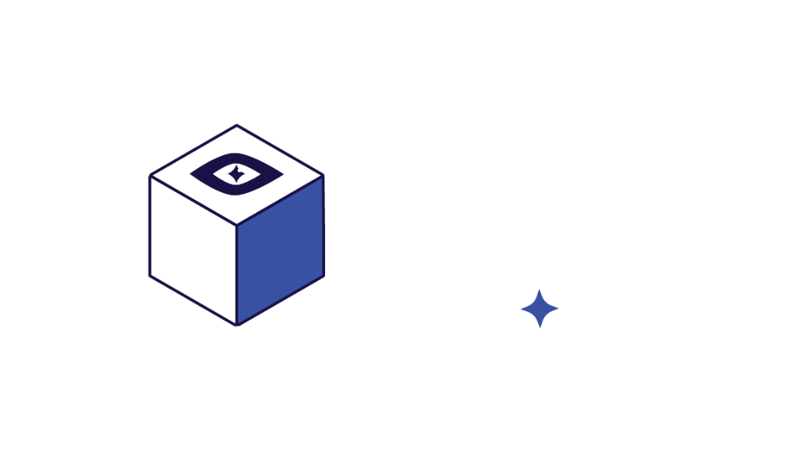

<p align="center">
  
</p>

# Intelli IPS (Intrusion Prevention System)

Intelli IPS is an AI-driven Intrusion Prevention System designed for IoT networks. It features a hybrid signature-based and Isolation Forest machine learning anomaly detection engine, coupled with a high-performance network topology visualization, scenario simulations, and automated security auditing.

---

## 🚀 Key Features

* **Real IoT Network Monitoring**: Scan your local subnet (via ping sweeps and ARP cache parsing) to discover actual local devices and monitor live latency and connection health.
* **Real-time Visualization**: Dynamic IoT mesh network animations and packet traffic flows with distinct layouts—concentric circle layout for simulation and a top-down hierarchical tree layout (Gateway -> IPS Console -> Clients) for real network modes.
* **Hybrid Threat Detection**: Signature-based inspection combined with an Isolation Forest ML engine.
* **Simulation Lab & Active Monitor**: Run preset security scenarios (such as DDoS attacks) or monitor active subnet quarantines and whitelists directly from the sidebar console.
* **Explainable AI (XAI)**: Detailed diagnostic reports and feature breakdown of threats in the Actions Log.
* **Automated Mitigation**: Download host firewall scripts (PowerShell / Bash) directly from diagnostic reports.
* **Analytics**: Export complete telemetry and security audit data to CSV.

---

## 💻 Getting Started (For End Users)

### 1. Download & Install
1. Go to the [Releases Page](https://github.com/undoubtedlynabgha/intelli-IPS/releases) and download the latest version (`Intelli.IPS.Setup.1.0.2.exe`).
2. Run the installer and follow the prompts.
3. Launch **Intelli IPS** from your Start Menu or Desktop.

> [!NOTE]
> The backend service (`ips_backend.exe`) starts and runs automatically in the background when you launch the application.

### 2. Quick Demo Guide
* **Login Credentials**:
  * **Username**: `admin`
  * **Password**: `admin`
* **Start Simulation**: Click **Start Simulation** on the Dashboard or Network Map to begin simulated IoT traffic.
* **Trigger Attacks**: Open the **Simulation Lab** panel on the right of the Network Map and run a preset (e.g., *DDoS Attack on Hub*) to see real-time anomaly detection and mitigation.
* **Retrain ML Model**: Navigate to **ML Evaluation** to adjust contamination rate/tree counts and retrain the model live.
* **Export Audit Data**: Go to the **Analytics** tab to export complete telemetry logs to CSV.

---

## 🛠️ Developer Setup (For Code Inspection)

If you wish to run the project in development mode:

### Prerequisites
* **Node.js** (v16.0 or higher)
* **Python** (v3.9 or higher)

### Installation
1. Clone the repository and install frontend dependencies:
   ```bash
   npm install
   ```
2. Set up the Python virtual environment and backend dependencies:
   ```bash
   cd backend
   # Windows
   python -m venv venv
   .\venv\Scripts\activate
   pip install -r requirements.txt
   cd ..
   ```
3. Set up the Groq AI API Key (Optional):
   Create a `.env.local` file in the root directory and add:
   ```env
   GROQ_API_KEY=your_real_groq_api_key
   ```
4. Run the Dev Server:
   ```bash
   npm start
   ```
   This concurrent pipeline starts the FastAPI backend, Vite dev server, and Electron shell.
